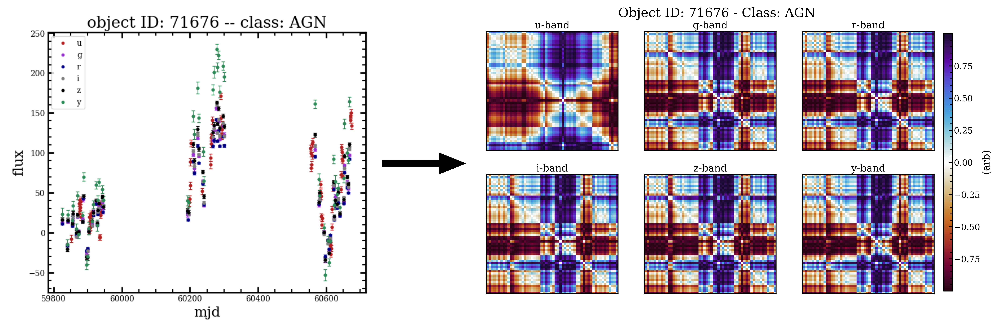

# Time-series to image transformations for Photometric light curve classification

---

## Overview

This project demonstrates how **multi-band 1D photometric light curves** can be transformed into **2D image representations** suitable for convolutional neural networks (CNNs) and residual networks (ResNets).  
By converting temporal signals into structured images via **Gramian Angular Fields (GAF)** and **Markov Transition Fields (MTF)**, we can apply image-based deep learning methods to classify **astronomical transient events** such as supernovae, AGN, tidal disruption events, and more.

The dataset originates from the [Kaggle PLAsTiCC 2018 challenge](https://www.kaggle.com/competitions/PLAsTiCC-2018), which aimed to classify simulated astronomical transients across multiple wavelength bands.

---

## Rough methodology

### 1. **Time-Series Encoding**
Each transient light curve (across the `ugrizy` bands) is converted into a **12-channel image (40×40 pixels)**:
- 6 channels from the **Gramian Angular Field (GAF)** (global temporal correlation)
- 6 channels from the **Markov Transition Field (MTF)** (local state transitions)

The image representation captures both global and local temporal structures of the original light curve.

### 2. **Model Architectures**
Three neural network architectures are implemented:
| Model | Description | Use Case |
|--------|--------------|-----------|
| **`CNN_small`** | Lightweight CNN with adaptive pooling | Quick experiments / small data |
| **`CNN_medium`** | 3-layer CNN with dropout and batch norm | Balanced capacity and interpretability |
| **`ResNet18`** | Residual Network adapted for 12-channel input | High-capacity model for rich data |

Each model supports training with **Adam** or **SGD** optimizers, **dropout** for regularization, and **OneCycleLR** learning rate scheduling. But any PyTorch optimizer of schedule can be added at will.

---

## Data Loading and Preprocessing

Images and labels are stored in a compressed `.npz` file which was made with the `data/make-all-fields.py`:
```python
data = np.load('gaf-mtf-training_images_labels.npz', allow_pickle=True)
```
Not this file is too large for github so storing on google-drive or dropbox and grab from there.

